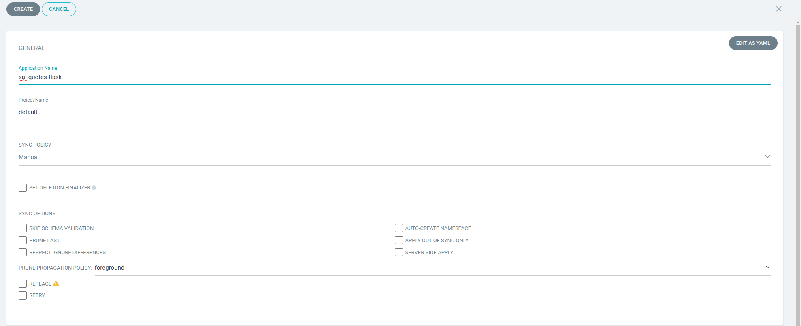
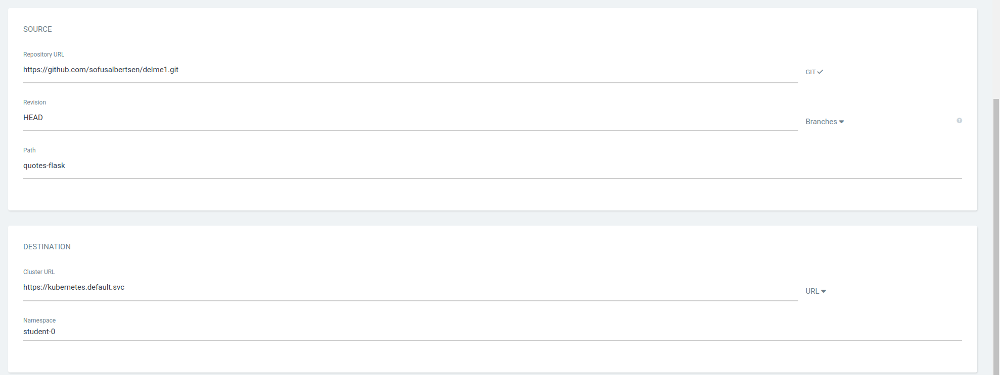
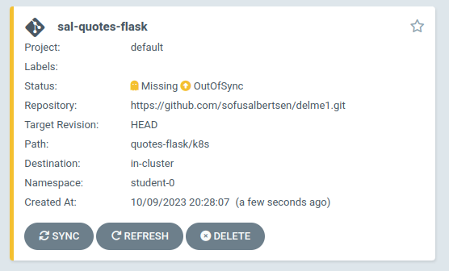

# Setup

## Learning Goals

- Fork and manage repositories in GitHub.
- Understand and utilize ArgoCD repositories.
- Familiarize with the "app of apps" setup in ArgoCD.
- Navigate and interact with the ArgoCD UI.

## Introduction

In this exercise, you will be deploying the `quotes-flask` application using `kubectl` and integrating it with ArgoCD. This will give you hands-on experience with application deployment and management in ArgoCD.

## Subsections

- **Forking the Repository**
- **Sharing the Fork with Trainer**
- **Setting up "App of Apps"**
- **Exploring the ArgoCD UI**

<details>
<summary>:bulb: About ArgoCD</summary>

ArgoCD is a declarative, GitOps continuous delivery tool for Kubernetes. It facilitates the management and deployment of applications within Kubernetes using Git repositories as the source of truth for defining the desired application state.

</details>

## Exercise

### Overview
In this exercise we are creating your own instance of this templated repository, connecting that to ArgoCD

- Creating an instance of the template repository
- Access and familiarize with the ArgoCD UI.
- Setup an "app of apps" within ArgoCD.

### Step by Step Instructions

<details>
<summary>More Details</summary>

### Overview


<details>
<summary>:bulb: This requires git email and name to  configured on your machine. If you have not done this, here are the commands to set it up</summary>

You need to provide your email and name to git with the following commands.

``` bash
git config --global user.email "you@example.com"
git config --global user.name "Your Name"
```

</details>

### Tasks

**Creating a repository from the template**

-  Go to Code tab of this repository and click `Use this template`


-  Select your GitHub user as the owner and name the repository. Leave the repo public to have unlimited action minutes.

> :bulb: **From this point forward, all actions should be performed in the repository you just created, not the template repository**

**Exploring the ArgoCD UI**

- Open a browser and navigate to the provided ArgoCD instance URL.
- Log in using the provided credentials.
- See that the main page shows a list of applications that are currently deployed in the cluster.
- In the navigation bar, click on `Settings` to create a connection to your own repository.
- Click on `Repositories` and then `Connect Repo`.
- Fill in the following details:
  - **Connection method**: `HTTPS`
  - **Type**: `Git`
  - **Project**: `default`
  - **URL**: <your repository URL>
- Click on `Connect`.
- See that the repository is now connected to ArgoCD.


**Setting up "App of Apps"**

In order to do this, we first need to know our own namespace. We can do this by running the following command:

``` bash
kubectl config view --minify -o jsonpath='{..namespace}'
```


- Click on `Applications` in the navigation bar to see the list of applications that are currently deployed in the cluster.
- Click on `New App` to create a new application.
- Fill in the following details:
  - **Application Name**: <your name>-quotes-flask
  - **Project Name**: `default`
  - **Sync Policy**: `Manual`
  - **Repository URL**: <your repository URL>
  - **Revision**: `HEAD`
  - **Path**: `quotes-flask/k8s`
  - **Cluster**: `in-cluster`
  - **Namespace**: <your namespace>




- Click on `Create`.
- Head back to the main page and see that the application is now listed.



The application is in a `OutOfSync` state. This is because we have not yet synced the application with the repository. We will do this in the next step.

</details>


